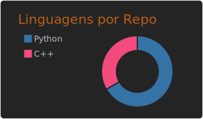

# Olá, eu sou o Pedro! 👋

Sou um desenvolvedor em evolução, focado em criar soluções práticas e organizar processos através da programação. Atualmente, estou expandindo meus horizontes de Python para o mundo de baixo nível com C++.

---

### 🛠️ Linguagens e Tecnologias

---

### 🎯 O que estou estudando no momento?

* **Linguagem C++:** Explorando performance, ponteiros e algoritmos.
* **Versionamento:** Dominando o Git para integrar meus projetos automaticamente.
* **Lógica de Programação:** Aperfeiçoando a estruturação de sistemas modulares e eficientes.

---

### 📝 Projetos

**Em andamento** 
[Terminal.br](https://github.com/pedrovfpprogram/terminal) - Terminal em português para Windows feito totalmente em Python

---

### 📊 Linguagens por Repo

---
*Estudando hoje para construir o amanhã.*
